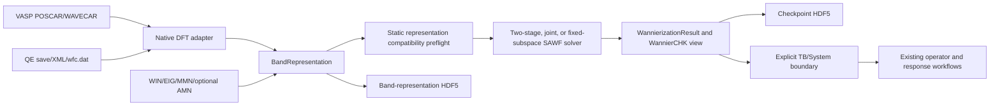

# Symmetry-adapted Wannier functions

## 1. Scope and status

`WannierNLQG.Wannierization` is the expert API for constructing either
symmetry-adapted Wannier functions (SAWFs) or ordinary full-BZ MLWFs without a
Python or WannierBerri runtime dependency. The first-stage implementation supports native VASP
`POSCAR`/`WAVECAR` and Quantum Espresso `prefix.save` wavefunctions, scalar or
spinor band representations, complete representation-block windows,
disentanglement, localization, deterministic serial/thread execution, and
versioned HDF5 persistence.

The independent response facade exports
the grouped response configuration types, typed observable selectors,
`RunResult`, and `run`. Import the expert namespace
explicitly:

```julia
using WannierNLQG
import WannierNLQG.Wannierization as W
```

The Wannierization facade exports exactly
`SymmetryAdaptedWannierizationConfig`, `WannierizationResult`, and
`construct_symmetry_adapted_wannier_functions`. All other supported expert APIs
remain available by explicit qualification, for example `W.generate_wannier_amn`.

The extension implementation uses the private nested modules
`WannierizationInternalSupport`, `RepresentationPreparation`, `ProjectionSearch`,
`PAWMatrixElements`, `SolverCheckpoint`, `OperatorExport`, and
`WorkflowOrchestration`. They expose only contract-listed integration names to
one another; the parent extension explicitly rebinds the established expert
entrypoints and does not bulk-import a component namespace. Direct stdlib,
external-package, project-module, component, and symbol imports are checked
against `test/contracts/wannierization_components.toml`. Checkpoint legacy
readers remain in `SolverCheckpoint`;
retired duplicate `Legacy*WavefunctionSource` and `LegacyBandRepresentation`
models are not compatibility readers and have been removed.

This stage intentionally excludes ABINIT, Wannier90 UNK input, GPAW, general
MPI workflow orchestration, NPZ
compatibility, a full topological-obstruction classifier, and localization
pseudoinverse or regularization fallback paths. Type-I--IV magnetic-group operation
algebra, complete corepresentation windows, and target multiplicity are hard
preflight contracts; they do not by themselves prove Wannierizability.

The expert public-schema-1.0 workflow separates disentanglement (`Z`) from
localization (`U`). Under `schedule=:two_stage`, a sealed
`DisentanglementState` owns the projector/frame field, invariant spread,
outer/frozen masks, residual, history, and convergence status. The Z stage does
not evaluate centers, full spread, U gradients, line searches, or localization
polar transports. Schema-2.27 and older target-scoped checkpoints remain
diagnostic-only and cannot be continued under the PAW-S leakage-weight contract.

Spectral clustering, frame transport, and projectability use
`WannierizationNumericalThresholds`; `representation_tolerance` remains solely
an invariant/representation tolerance. With `wannierization_mode=:ordinary`
and `algorithm_profile=:auto`, the solver unconditionally selects
`:smv_fletcher_reeves_two_stage`. With nontrivial symmetry and the same `:auto`
selection, it uses
`:symmetry_projected_smv_fletcher_reeves_two_stage`: the objective and gradient
remain full-BZ quantities, while FR inner products, transport, restart, and
retraction act only after star pullback and magnetic little-group projection.
A current-contract identity group retains this new profile provenance but executes
the ordinary exact arithmetic as a value-for-value fast path. A missing, stale, malformed, or
digest-mismatched audit manifest never blocks Z/U and does not participate in
candidate selection, convergence/production qualification, or scientific and
restart digests. The accepted-step audit reference remains `5e-12` absolute
plus `5e-8` relative. Projector, mask, Z-to-U initialization, finite-value,
rank, isometry, frozen-inclusion, and PAW data-integrity gates remain strict.

Wannier90 numerical-audit evidence is input-, platform-, precision-, budget-,
and initialization-specific. It is not extrapolated to other configurations.
PAW-SCDM uses the same optimizer without claiming AMN initial-state parity.
The removed `:wannier90_fletcher_reeves` path was not formula-equivalent and is
accepted only as read-only legacy checkpoint provenance. Expert alternatives include
`disentanglement_algorithm=:grassmann_trust_region`, Riemannian CG/L-BFGS, deterministic multi-start,
and AMN/PAW-SCDM/projectability initialization. Physical input contracts remain
fail-closed.

`PAWSCDMInitialization()` consumes an explicit `PAWSCDMInputArtifact`, normally
prepared with `prepare_paw_scdm_input_artifact(gauge_hdf5,
representation_hdf5, output_hdf5; num_wannier)`. The bridge reuses completed
full-cutoff WFC coefficients and recomputed projector overlaps from the strict
augmentation-aware gauge artifact, including the parsed nonzero PAW/USPP
`Q` metric. It binds the gauge, strict representation, Hamiltonian authority,
k mesh, band/spinor layout, cutoff inventory, atom/projector plan, and input
digests. Missing or mismatched data fail closed; MMN/AMN are never used to
invent native PAW data.

An augmentation-aware `PAWSCDMInputArtifact` is not itself a SAWF authority.
With explicit `wannierization_mode=:ordinary`, its strict gauge/representation Hamiltonian and magnetic
identity is input provenance only. The solver builds a full-BZ identity
representation, skips symmetry projection, little-group processing, and
covariance rejection, while retaining covariance as `DIAGNOSTIC_ONLY`.
The symmetry-adapted mode keeps the original strict gate.

The contiguous raw-Z kernel and MPI k-point decomposition are qualification
lanes. U localization also provides an expert `parallel=:mpi` edge lane: each
`(kpoint, neighbor)` contraction has one cyclic MPI owner, a dense unique-owner
edge inventory is reduced, and objective/gradient sums are reconstructed in
the canonical serial order. Serial remains the default. Promotion requires
serial--MPI parity plus determinism, allocation, RSS, and speed evidence.
`hot_storage_backend=:auto` otherwise retains the legacy serial kernel.

## 2. Architecture and data flow



Dependency direction is
`Wannierization -> SymmetryFoundation/WannierProjection/IO/Core`.
`Wannierization` cannot import `Symmetrization`, `Responses`, or `Runtime`.
VASP/QE parsing, HDF5, and the workflow live in a package extension triggered
by `HDF5`, `JSON3`, and `EzXML`; ordinary `using WannierNLQG` does not load
those packages. The first real detection call delegates to
`SymmetryFoundation`, whose loader uniquely loads Spglib and exposes backend
identity through `symmetry_detection_backend_provenance`.

## 3. Wavefunction sources

### VASPWavefunctionSource

`VASPWavefunctionSource(poscar_file, wavecar_file; ...)` reconstructs fixed
WAVECAR records, VASP G-vector order, scalar/collinear or two-component spinor
coefficients, and an optional lower representation cutoff. `spin_channel` is
one-based. `magnetic_moments_cartesian=nothing` means no magnetic moments are
read or inferred. Magnetic spinor input must provide `incar_file` containing an
explicit `SAXIS`, or an explicit `spin_basis_saxis`; the reader converts VASP's
spin basis to the shared Cartesian basis and fails closed when the convention is
missing or contradictory. Inputs are read-only and are recorded by SHA-256.
Explicit moments are defensively copied as `3×num_atoms` Cartesian axial
vectors and receive a stable IEEE-754 digest. If INCAR also declares `MAGMOM`,
the two sources must agree.

Native VASP PAW matrix elements use `NativeVASPPAWMatrices` and additionally
require `potcar_file` plus the same-run `outcar_file`; missing OUTCAR fails as
`VASP_PAW_OUTCAR_REQUIRED`. The OUTCAR validates the complete WIN LOCPROJ row
order, VASP `[-0.5,0.5)` center image, local axes, default radial selector, and
`spin_qaxis`. Trial spinors use VASP's Euler/SU(2) convention and are normalized
with the PAW generalized metric before `A=A_tilde+P^dagger Qd` is formed. The
AMN `CQIJ` numerical contract uses the AE-minus-PS partial-wave radial integral
for both normalization and augmentation. Finite-b MMN retains the independent
POTCAR-tabulated augmentation path. Neither path constructs a three-dimensional
all-electron wavefunction, and oracle arrays are validation-only.

Full `s`, `p`, and `d` projection shells are supported by the native VASP PAW
AMN path. The `d` rows use the ordered real harmonics
`(dz2, dxz, dyz, dx2-y2, dxy)`, the same radial quadrature with `l=2`, and the
Fourier phase `(-i)^2`. The same-run OUTCAR still verifies every projection row;
unsupported radial selectors or incomplete projection contracts remain errors.

Raw native VASP AMN remains the oracle-facing product and is written as
`native_paw.amn`. Immediately before SAWF initialization, the native workflow
constructs a separate solver-facing file, `native_paw.wannierization.amn`, using
`A_solver(k) = A_raw(k) D_T(k) U_q^dagger`, with
`D_T[n,n] = exp(+i 2pi k.T_n)`. `T_n` is the validated integer center image and
`U_q` is VASP's validated `spin_qaxis` rotation for each paired spinor
projection. External Wannier90/legacy AMN is never transformed implicitly.
Malformed pairing or metadata, a non-unitary column transform, a failed
raw/solver roundtrip, or changed band-space projector fails closed as
`VASP_PAW_SOLVER_GAUGE_ADAPTER_FAILED`. Current provenance wire schema 1.0 preserves the former 1.2 contract and stores distinct
raw/solver array and file hashes, the phase and matrix-order conventions,
unitarity, roundtrip, projector, rank, and conditioning diagnostics.

VASP PAW spin matrices are a parallel native data product. Call
`generate_vasp_paw_spn(source; output_spn_file, provenance_hdf5, spin_channel)` or
`scripts/generate_vasp_paw_spn.jl` with explicit POSCAR/POTCAR/WAVECAR,
band range, spin channel, and INCAR/SAXIS. The generator contracts raw
full-cutoff spinors and PAW projector overlaps with the POTCAR (Q_0) metric,
writes dimensionless Cartesian Pauli (x,y,z) matrices in Wannier90 SPN
lower-triangular order, and seals schema-1.0 provenance. It never reconstructs
PAW data from MMN/AMN. The generator requires the spin channel a second time
as an explicit keyword and fail-stops if it differs from the source contract.
`write_wannier_spn` provides deterministic binary and
formatted SPN output with a fixed 60-byte binary header.
`read_vasp_paw_spn_provenance(path)` recomputes the schema-1.0 logical payload
digest and, by default, verifies the referenced SPN byte digest; moved or
tampered artifacts fail closed.

### QuantumEspressoWavefunctionSource

`QuantumEspressoWavefunctionSource(save_directory; ...)` reads
`data-file-schema.xml` plus native `wfc*.dat`, `wfcup*.dat`, `wfcdw*.dat`, or
QE 7.x `wfc*.hdf5` without renaming one format as another.
Use `spin_channel=:none` for scalar/noncollinear input and `:up` or `:down` for
a collinear channel. The XML defines lattice, k points, energies, cutoff, and
spin metadata; binary/HDF5 coefficient records are validated before use. QE
atomic-type labels such as `Ni1` and `Ni2` are canonicalized from the copied
UPF `PP_HEADER element`; the original labels and mapping remain in provenance,
and a missing or conflicting element fails closed.
The reader exposes two expert-selectable sewing backends. The default
`CoefficientMappingSewing()` preserves the historical G/spinor coefficient-map,
conditioned-right-inverse, and energy-block polar route. For PAW/USPP its
per-band Euclidean coefficient gauge is not interpreted as `<psi|S|psi>`.
`AugmentationAwareSewing()` instead reads the complete unnormalized native
cutoff and evaluates

$$
B_g(k)=C_{gk}^{\dagger}C_{g\leftarrow k}
       +P_{gk}^{\dagger}Q_0P_{g\leftarrow k}.
$$

The transformed source state is reprojected in the authoritative target-k beta
basis after the complete spatial, translational, spinor, and antiunitary action.
QE NC input reduces exactly to the identity metric; QE PAW/USPP reuses the UPF
beta/Q backend. Missing augmentation data, a representation cutoff, normalized
input, non-bijective G mapping, source-identity failure, or a non-closed target
subspace fails as `PAW_SEWING_HOLD` or a more specific fail-stop code and never
falls back to coefficient mapping. Native QE AMN generation remains separately
guarded by its physical-overlap contract.
PAW-aware MMN/AMN from `pw2wannier90` enter the SAWF workflow through
`ExternalWannier90Matrices` and do not use the native pseudo-overlap path.
Representation provenance records `qe_reader_purpose`, `qe_metric_kind`,
`coefficient_normalization`, `sewing_construction`, `physical_overlap_available`,
`augmentation_backend`, and `qualification`.
Both readers record `spin_mode` and `spin_channel` in representation provenance.
A `collinear_single_channel` source cannot represent an antiunitary operation
that exchanges spin channels and fails before sewing construction with
`ANTIUNITARY_CHANNEL_MIXING_UNSUPPORTED`. This does not reject a genuinely
scalar, spinless source merely because its group contains time reversal.

### Standalone k-star-covariant wavefunction gauge

`AbstractWavefunctionGaugeBackend` is independent of the sewing metric.
`NativeEigenstateGauge()` preserves the current/default eigenvectors, while the
expert `StarCovariantPAWGauge()` is permitted only with
`AugmentationAwareSewing()`, the complete native cutoff, and complete
projector/Q data. `prepare_symmetry_covariant_wavefunctions(config)` chooses the
lowest full-grid index in each k-star, builds a PAW-S Lowdin frame there, and
checks closure with complete 5-meV clusters, a 0.10-eV hard cap, and at most
eight retained buffer bands per star. Every available native band remains
visible to the leakage audit; the retained-buffer ceiling cannot hide omitted
weight.

The representative Hamiltonian is Reynolds-averaged with the correct unitary
or antiunitary pullback and rediagonalized only in qualified energy blocks.
Physical sewing may merge blocks separated by at most 20 meV; a more distant
above-threshold coupling is `BLOCK_PARTITION_HOLD`. All other star points are
generated by canonical magnetic transport rather than by independent
eigensolver gauges. The self-contained
`WannierNLQG.star_covariant_paw_gauge/1.0` HDF5 capsule binds the PAW data,
representative frames, rectangular rotations, operations, input hashes, and
preflight metrics. `SymmetryCompletedQEPAWMatrices` directly recomputes
PAW-aware MMN/AMN from completed states and compares them with the independent
rectangular-parent rotation oracle. Backend, source, artifact, or direct/oracle
mismatch fails before representation, Z, U, or TB construction.

With `construction_policy=:diagnostic`, completed-state matrix generation and
native-DFT Hamiltonian construction can consume an integrity-verified diagnostic
gauge capsule. Finite generalized-norm or external-reference MMN/AMN parity
failures retain their original metrics and FAIL status while construction
continues. Augmentation-aware representation preparation follows the same policy
for finite sewing and energy residuals. Required rank, positive-definite metrics,
discrete cocycle consistency, source identity, and the direct/rotation propagation
identity remain mandatory. `:strict` preserves the original quality rejection.

### Friendly projections and reusable AMN

`WannierNLQG.WannierProjection.ProjectionSpec` is the high-level projection
declaration. One spec selects centers from an explicit `3 x N` fractional
position matrix or from a `CrystalStructure`, accepts ordered orbital sets,
and broadcasts either one right-handed local basis or one basis per center.
Canonical expansion order is spec, center, orbital set, existing orbital
label, then interlaced spin. Expert `indices` may permute this order only when
the merged basis is exactly `1:num_wannier`. The WIN parser uses this same
expander, so manual and WIN declarations have one AMN-column convention.

`ProjectionRadialTransformConfig` selects one radial transform for the complete
basis. The public default is `method=:gauss_laguerre_high_precision` with
`gauss_laguerre_order=64`; it evaluates the Fourier--Bessel integral directly
and does not pass through a tabulation spline. The expert-only
`method=:wannierberri_compatible` reproduces the fixed mixed grid,
trapezoidal integration, and not-a-knot spline used by the compatibility
oracle. Select it explicitly only for parity work:

```julia
radial = WannierNLQG.WannierProjection.ProjectionRadialTransformConfig(
    method=:wannierberri_compatible,
)
basis = WannierNLQG.WannierProjection.WannierProjectionBasis(
    specs; structure, spinor=true, radial_transform=radial,
)
```

AMN provenance records the selected method, quadrature or grid/spline
parameters, and an implementation digest. The expanded-basis and restart
digests include this contract, so a checkpoint cannot resume under the other
backend. One parameter campaign must freeze one AMN and radial method.

Formatted AMN is public I/O:

```julia
amn = WannierNLQG.IO.read_wannier_amn("seed.amn")
WannierNLQG.IO.write_wannier_amn("copy.amn", amn)
amn = W.generate_wannier_amn(source, basis; amn_file="seed.amn")
```

The writer uses 17 significant digits and atomic replacement. Native
generation may also write a `WannierNLQG.amn_provenance/1.0` companion with
the expanded basis, radial algorithm, coordinate/spin convention, and
input/basis SHA-256. An internally qualified common AMN can initialize Julia
and an offline oracle without rereading the DFT wavefunction for every
parameter trial. Numerical coefficient/block-projector differences from
WannierBerri are reference diagnostics, not qualification failures.
Native QE AMN generation is available only for norm-conserving input while the
reader lacks a beta/Q backend. QE PAW/USPP runs must supply an external
augmentation-aware AMN, normally produced by `pw2wannier90`.

## 4. Configuration reference

`SymmetryAdaptedWannierizationConfig` has exactly five public fields. Each field
holds one immutable configuration group; configuration leaves belong to their
owning group.

| Group field | Type and responsibility |
| --- | --- |
| `input` | `WannierizationInputConfig`: physical inputs, representations, windows, dimensions, and compatibility tolerances. |
| `solver` | `WannierizationSolverConfig`: algorithms, initialization, numerical controls, iteration limits, parallel mode, and seed. |
| `checkpoint` | `WannierizationCheckpointConfig`: restart, fixed-subspace, and checkpoint persistence. |
| `runtime` | `WannierizationRuntimeConfig`: progress and the cold-path iteration callback. |
| `output` | `WannierizationOutputConfig`: representation/TB/operator outputs, provenance, formats, and export qualification tolerances. |

The table below lists the leaf keywords accepted by those five group
constructors. A concise overview is in the
[configuration reference](WANNIERIZATION_CONFIG_MIGRATION.md).

| Leaf field | Meaning |
| --- | --- |
| `wannierization_mode` | Sole public mode tag: `:auto`, `:ordinary`, or `:symmetry_adapted`. `:auto` resolves to the established symmetry-adapted default; `:ordinary` disables symmetry constraints. |
| `algorithm_profile` | Ordinary `:auto` unconditionally resolves to `:smv_fletcher_reeves_two_stage`; nontrivial symmetry-adapted `:auto` resolves to `:symmetry_projected_smv_fletcher_reeves_two_stage`. A current-contract identity group uses the latter profile label with the ordinary exact numerical fast path. `:custom` remains required for explicit projected-gradient, Riemannian-CG, L-BFGS, Grassmann trust-region, or alternate expert choices. |
| `smv_fletcher_reeves_two_stage_audit_thresholds` | Named, serializable, nonblocking numerical-audit contract. It freezes the accepted-step absolute/relative comparison without relaxing masks, dimensions, rank, isometry, projector, or Z-to-U gates, and is excluded from scientific/restart digests. |
| `smv_fletcher_reeves_two_stage_audit_manifest` | Optional JSON3 audit manifest that reports `PASS/MISSING/INVALID/DIGEST_MISMATCH` provenance only. Its state never changes ordinary default selection or numerical arrays. |
| `source` | Optional native VASP/QE wavefunction source. With symmetry-adapted mode and no supplied representation it implies internal `representation_source=:detected`; it may also generate native PAW matrices or AMN. |
| `sewing_backend` | Expert sewing/metric backend. `CoefficientMappingSewing()` is the unchanged default; `AugmentationAwareSewing()` is the fail-closed full-cutoff PAW/USPP route. It may seed ordinary no-symmetry PAW initialization and does not automatically enable SAWF. |
| `wavefunction_gauge_backend` | Expert wavefunction gauge. `NativeEigenstateGauge()` is the default; `StarCovariantPAWGauge()` selects the strict k-star stage. |
| `wavefunction_gauge_hdf5` | Schema-1.0 physical-frame artifact (complete former 1.11 contract) required by a target-scoped `StarCovariantPAWGauge()` route; backend, authority, physical metric/replay, leakage formula/threshold, or digest mismatch forbids reuse. Formal readback replays the digest-bound raw source. Schema-1.10 remains diagnostic and cannot be upgraded in place. |
| `authoritative_hamiltonian` | `NativeDFTHamiltonian()` preserves the native DFT matrix values; `SymmetrizedDFTHamiltonian()` uses the Reynolds-projected DFT values. This choice is independent of qualification scope. With a target contract, either route uses the outer window as its sole physical authority and retains the complete parent as an audit. The only persisted identities are `native_dft` and `symmetrized_dft_hamiltonian`; retired candidate identities are rejected with `UNSUPPORTED_LEGACY_AUTHORITY`. |
| `target_subspace_contract` | Optional `TargetSubspaceQualificationContract` for the standalone wavefunction-preparation stage. It binds finite outer/frozen bounds, ragged qualification masks and SHA-256 identities, `authority=:outer_window`, `parent_audit_policy=:audit_only`, `num_wannier`, and the scoped PAW/Hamiltonian thresholds. Every target-scoped route must provide it; `SymmetrizedDFTHamiltonian` is always target-scoped, while `NativeDFTHamiltonian` may explicitly elect the same scope without changing its Hamiltonian values. |
| `win_file` | Wannier90 WIN structure/projection authority. |
| `eig_file` | Wannier90 EIG energies in eV. |
| `mmn_file` | Wannier90 MMN neighbor overlaps. |
| `amn_file` | Optional formatted AMN; otherwise generated only when the native source exposes a physical overlap metric. |
| `matrix_elements` | Typed `ExternalWannier90Matrices` or `NativeVASPPAWMatrices`; external QE PAW MMN/AMN is the qualified physical-overlap path, and neither QE nor VASP falls back to pseudo AMN. |
| `projection_basis` | Optional prebuilt ordered projection basis; WIN is used when absent. |
| `band_representation` | Optional in-memory `BandRepresentation`. |
| `band_representation_hdf5` | Optional versioned representation checkpoint. |
| `symmetry_tolerance` | Detection tolerance; persisted and scientific/hash-relevant only when internal `representation_source=:detected`. |
| `outer_min_ev` | Lower outer-window energy in eV. |
| `outer_max_ev` | Upper outer-window energy in eV. |
| `frozen_min_ev` | Lower frozen-window energy in eV; default makes the window empty. |
| `frozen_max_ev` | Upper frozen-window energy in eV; default makes the window empty. |
| `frozen_states` | Explicit `(kpoint, band)` states. Symmetry-adapted mode completes representation blocks; `:ordinary` retains the exact singleton mask. |
| `num_wannier` | Target dimension; zero derives it from the projection basis. |
| `initialization` | `:amn`, `:random`, `:restart`, or sealed `:fixed_subspace`. |
| `restart_hdf5` | Checkpoint required by `initialization=:restart`. |
| `fixed_subspace_hdf5` | Wire `1.0` capsule with schema `wanniernlqg.wannierization-fixed-subspace`, required by `initialization=:fixed_subspace`; historical `wanniernlqg.sawf-fixed-subspace` 1.0/1.1 capsules remain read-only compatible under their original validation rules. |
| `z_mix_ratio` | Independent Z mixing ratio in `[0,1]`. |
| `u_mix_ratio` | Independent unitary-geodesic U mixing ratio in `[0,1]`. |
| `acceleration` | `WannierizationAccelerationConfig`; defaults to `schedule=:two_stage` and `u_acceptance=:armijo`. |
| `numerical_thresholds` | Independent Hermitian, boundary-cluster, frame-transport, projectability-rank, and transport-condition thresholds. |
| `initialization_backend` | Expert `AMNExactFrozenInitialization()`, `PAWSCDMInitialization()`, or `ProjectabilityDisentanglementInitialization()` contract. |
| `paw_scdm_input_hdf5` | Digest-bound `PAWSCDMInputArtifact` required only by `PAWSCDMInitialization()`; gauge/representation/authority and native PAW identities are revalidated at consumption. |
| `multi_start` | Disabled-by-default deterministic multi-start identity and selected start index. |
| `max_iterations` | Overall solver safety ceiling; stage-specific limits live in `acceleration`. |
| `convergence_tolerance` | Population-standard-deviation convergence threshold. |
| `convergence_window` | Number of recent iterates used by the convergence test. |
| `little_group_tolerance` | Frame residual threshold; default `1e-6`. |
| `little_group_max_iterations` | Maximum repeated little-group projections. |
| `degeneracy_tolerance_ev` | Energy tolerance for complete band blocks. |
| `representation_tolerance` | Representation and invariant tolerance; not a spectral, transport, or projectability rank tolerance. |
| `empirical_covariance_budget` | Optional finite-cutoff covariance budget; never relaxes target algebra or frozen/isometry gates. |
| `target_center_matching_tolerance` | Geometric tolerance used only to choose the unique lattice image of each target center; default `1e-8`. |
| `construction_policy` | `:diagnostic` (default) retains failed quality checks and continues feasible construction; `:strict` preserves historical blocking behavior. Diagnostic artifacts require manual review. |
| `compatibility_policy` | `:strict`, `:warn`, or `:off` controls compatibility evaluation; `construction_policy` determines whether quality failures stop construction. Missing data and impossible subspaces still stop. |
| `localize` | Enable localization; the formal path is a symmetry-projected MV gradient with rank-gated polar retraction and Armijo search. |
| `symmetrize_z` | Project Z over each little group. |
| `parallel` | `:serial`, deterministic `:threads`, or expert `:mpi`. The MPI route cyclically owns Z k points and U `(kpoint,neighbor)` overlap edges, reconstructs canonical serial sums on every rank, and restricts durable output to rank 0 after a cross-rank payload-digest check. |
| `random_seed` | Fixed seed for deterministic random initialization. |
| `checkpoint_hdf5` | Requested validated/failure checkpoint path; new output must end in `.wannierization.h5`. A legacy `.sawf.h5` is accepted only through `restart_hdf5`, never as a new output. |
| `band_representation_output_hdf5` | Optional output path for the reconstructed representation. |
| `progress_interval` | Iteration interval for `.wannierization.out`; default 10 and zero disables periodic blocks. |
| `checkpoint_interval` | Iteration interval for complete atomic restart checkpoints; default 10 and zero disables periodic writes. |
| `iteration_observer` | Optional in-process diagnostic callback; excluded from the scientific restart hash. |
| `tb_output_formats` | Legacy format selector retained for one migration cycle. A finite invariant-valid accepted state always emits Packed HDF5. |
| `write_wannier90_tb` | Optionally emit the Wannier90 `*_tb.dat` exchange file; default `false`. |
| `profile` | Final Packed-HDF5 output policy: `:hamiltonian_position`, `:hamiltonian_position_spin`, or `:full`. It is excluded from the solver restart digest. |
| `final_tb_symmetry_report_enabled` | Controls the `FINAL DIAGNOSTIC TB SYMMETRY` report block. `nothing` enables it for symmetry-adapted mode and disables it for ordinary mode; `true`/`false` force display/hide without changing checkpoint or solver state. |
| `spn_file` | SPN input required by `:hamiltonian_position_spin` and `:full`. |
| `spn_provenance_file` | Schema-1.0 SPN provenance (complete former 1.2 contract) required for source, metric, band/k-point order, frame transform/contract, and digest qualification of spin-bearing profiles. |
| `uiu_file` | uIu input required by `:full`. |
| `uhu_file` | uHu input required by `:full`. |
| `siu_file` | sIu input required by `:full`. |
| `shu_file` | sHu input required by `:full`. |
| `uiu_provenance_json` | Schema-1.0 uIu provenance sidecar (complete former 1.2 contract) required by `:full`. |
| `uhu_provenance_json` | Schema-1.0 uHu provenance sidecar (complete former 1.3 contract) required by `:full`. |
| `siu_provenance_json` | Schema-1.0 sIu provenance sidecar (complete former 1.3 contract) required by `:full`. |
| `shu_provenance_json` | Schema-1.0 sHu provenance sidecar (complete former 1.3 contract) required by `:full`. |
| `spn_formatted` | Read SPN from the formatted Wannier90 representation instead of sequential unformatted input. |
| `operator_files_formatted` | Read uIu/uHu/sIu/sHu from formatted representations instead of sequential unformatted input. |
| `operator_closure_tolerance` | Compatibility field: positive finite Galerkin-leakage diagnostic reference; default `1e-6`. An excess is `ABOVE_REFERENCE`, not a publication veto or operator-error estimate. |
| `spin_family_covariance_tolerance` | Positive finite covariance threshold for projected spin-family qualification; default `1e-8`. |
| `spin_family_idempotence_tolerance` | Positive finite repeated-Reynolds-projection threshold for spin-family qualification; default `1e-9`. |

`wannierization_mode` is the sole strict, hashed mode contract. The representation
source is inferred and persisted as `:identity`, `:detected`, or `:provided`:

- `:auto` resolves to `:symmetry_adapted` and keeps the established default.
- `:symmetry_adapted` detects the complete group from a native source when no
  representation is supplied, or consumes exactly one in-memory/HDF5 representation.
- `:ordinary` rejects in-memory non-identity representations. It either reads a validated
  identity representation from `band_representation_hdf5`, or constructs
  that identity record from the complete ordered WIN k mesh and lattice. It
  performs ordinary disentanglement/localization on every full-BZ k point and
  does not call symmetry detection, target planning, little-group projection,
  covariance projection, or IBZ expansion. The identity record has one unitary
  identity, no antiunitary operation, `kpoint_map[k]=k`, and singleton band
  blocks. `symmetrize_z` is recorded as requested but is effectively false.

The requested/effective mode, inferred representation source, constraint flag,
and effective algorithm tag all enter the authority and restart digests. Ordinary
mode permits `AugmentationAwareSewing()` to carry
the PAW-(S) metric and provenance; the identity-operation sewing remains the
identity matrix. Magnetic representation metadata cannot activate candidate
projection, little-group processing, or a covariance hard gate in this mode;
covariance is retained as a diagnostic.

With `:ordinary`, a formatted AMN permits `source=nothing`. If AMN is absent,
`source + projection_basis` may generate it without enabling symmetry
detection. Outer/frozen windows and projections remain active, and frozen
states are embedded exactly. Checkpoints, Packed HDF5 TB, and optional
Wannier90 `*_tb.dat` retain the mode, effective operation counts, initializer,
AMN digest, and applicability fields. A restart under a different mode is
rejected.

## 5. Solver contract

The finite-difference target is always full three-dimensional:

$$
\sum_b w_b\,\mathbf b\mathbf b^T=I_3.
$$

There is no `:periodic_subspace` or two-dimensional spread mode. The MMN
neighbor vectors are grouped into shells and solved against `I3`; vectors,
shell IDs, weights, completeness residual, and stencil digest are retained.
A stencil that cannot span all three Cartesian directions returns typed
`INVALID_INPUT` with `MMN_STENCIL_INCOMPLETE_3D`; it never silently assigns a
zero z weight. A finite shell-moment completeness residual above the quality
threshold retains its measured value and failed check; default diagnostic
construction continues with the computed weights. Strict mode rejects it.

In `:symmetry_adapted`, outer and frozen selections are completed to
energy-degenerate representation blocks. A frozen AMN run now starts from the
numerical AMN, embeds the exact frozen states, constructs the free complement,
projects both through the complete unitary/antiunitary target action, and then
applies rank/conditioning gates and polar retraction. Rank failure is reported
with singular values and condition number; it never falls back to target-only
random probes. Every symmetric iteration updates and mixes Z, projects it over
the little group, selects the maximum subspace while retaining the frozen
projector, mixes U independently, projects the frame again, updates
centers/spreads, and expands the IBZ state in deterministic k-star order.
At a symmetry-constrained Z step, the unconstrained largest eigenspace can be
invariant yet carry a different little-group corepresentation. The selector
therefore first retains the ordinary maximum eigenspace when its overlap with
the last accepted frame passes the rank/condition gate, and otherwise uses a
pivoted-QR maximum-volume fallback in the frozen-free complement. This
preserves the connected target
corepresentation sector while retaining the exact frozen projector. A
rank-deficient or over-conditioned reference overlap is a typed
`SUBSPACE_COREPRESENTATION_TRACKING_FAILED`; it is never repaired with a
pseudoinverse. `:ordinary` calculations retain the ordinary maximum
eigenspace selection.

In `:ordinary`, the same outer-window Z update, exact-frozen maximum-subspace
selection, MV spread gradient, polar retraction, Armijo search, convergence,
finiteness, isometry, and frozen-preservation gates run on the complete mesh.
Z, U, centers, spreads, and gradients are never symmetry projected. Covariance,
target multiplicity, and representation compatibility are explicitly
`NOT_APPLICABLE`, not successful symmetry checks.

`z_mix_ratio` never controls U and `u_mix_ratio` never controls Z. A rank-deficient
or ill-conditioned localization matrix returns a typed polar failure with its
singular spectrum; no explicit inverse, pseudoinverse, or regularization is used.
Type-I--IV inputs run one
static compatibility preflight before HDF5 publication or numerical iteration.
Operation identity, UU/UA/AU/AA products, corepresentation-window closure,
target group law, and target corepresentation multiplicity are hard gates. Any
static failure returns `REPRESENTATION_INCOMPATIBLE` independently of the
diagnostic display policy.

`target_center_matching_tolerance` does not relax the representation gate:
target group law, sewing, rank, and Kramers checks still use
`representation_tolerance`.

Supported schedules are exactly `:two_stage`, `:joint`, and `:fixed_subspace`.
`:nested`, every `nested_*` control, and legacy nested checkpoints are rejected
as `UNSUPPORTED_LEGACY_SCHEDULE`; duplicate `gradient_*` line-search controls
are rejected in favor of the canonical `u_*` controls.

`:two_stage` first minimizes the explicit gauge-invariant spread `Omega_I`
while updating only the selected projector/Z and preserving the frozen
embedding. Under the symmetry-projected profile it accepts the subspace only after
`Delta Omega_I`, projector drift, and the configured stability window pass. A
qualified symmetry-projected Z seal requires both
`abs(Delta Omega_I/Omega_I) <= 1e-10` and projector drift `<= 1e-10` for three
consecutive accepted iterations; ordinary exact SMV--FR retains its established
relative-objective termination order. Reaching the Z iteration ceiling is classified
as `DIAGNOSTIC_NONCONVERGED`, never as a qualified seal. The expert-only
`disentanglement_limit_policy=:diagnostic_continue` default continues into U
only when the last accepted state is finite, full rank, isometric,
frozen-containing, corepresentation covariant, and complete under k-star
expansion. A failed continuation gate records U as `NOT_RUN` and preserves the
checkpoint; a passed gate records U and any resulting model as
`DIAGNOSTIC_ONLY/Z_NONCONVERGED`. The explicit `:strict_hold` policy still stops
at the boundary. Neither policy makes a nonconverged route rankable or eligible
for a standard or production TB. Projected AMN is then polar/SVD
aligned to construct the localization frame, after which Z is frozen and only
U is optimized. The accepted stage boundary seals one full-BZ `S/P`; every
localization trial, checkpoint, and TB export verifies its hash and projector
drift and is forbidden from symmetrizing or diagonalizing Z again. The initial
frame is `S * polar(S' * A_raw)` (after the Type-III symmetry-compatible AMN
projection when applicable), not the exact-frozen structural initializer.
`:joint` is a transactional Type-IV block Gauss--Seidel update. It constructs
the Hermitized and unitary/antiunitary-symmetrized Z proposal on the IBZ,
selects a frozen-compatible maximum subspace, and transports the last accepted
frame as `F0 = S * polar(S' * F_old)`. Before deriving the candidate projector,
the newly selected IBZ subspace is expanded over every full-BZ k star; stale
non-IBZ entries from the previous accepted frame are never interpreted as the
new projector. It never realigns the first joint step to raw AMN. Rank,
conditioning, corepresentation, covariance, or `Omega_I`
rejection reduces the Z step by `joint_z_backtracking_factor` for at most
`joint_z_backtracking_max_steps`; Z, frame, convergence counters, and optimizer
history commit atomically only after the fixed-candidate-subspace branch-safe U
step also passes. Rejected proposals cannot contaminate history. Moving the
subspace clears Riemannian-CG history, so the qualified joint route uses the
symmetry-projected gradient. The joint terminal class is `CONVERGED` only when
the Z seal and the U gradient/residual/spread-window gates each pass for three
consecutive accepted iterations.

Gram orthogonalization, maximum-subspace selection, and the frozen-free
complement share one validated Hermitian spectral boundary. It first uses
`eigen(Hermitian(A))` and falls back to dense complex Schur decomposition only
when dimensions, finiteness, orthogonality, or reconstruction residuals fail.
Only an actually undersized selected subspace is a rank deficiency; a failed
spectral algorithm is reported as `HERMITIAN_SPECTRAL_DECOMPOSITION_FAILED`.
Fallback count, worst k point, spectral gap, and residual are retained.

The common U controls are `u_acceptance`, `u_initial_step`, `u_armijo_c1`,
`u_backtracking_factor`, `u_backtracking_max_steps`, and
`u_objective_tolerance`. `:armijo` requires sufficient decrease from the common
base point, `:monotone` permits only `objective <= base`, and
`:invariant_only` checks finite/isometry/frozen/symmetry invariants without an
objective-decrease requirement and is diagnostic-only. Localization search
failure is `LOCALIZATION_FAILED`; only a true rank failure is
`SINGULAR_LOCALIZATION`. A rejected trial Z and its derived `F0` are discarded;
the previous committed Z/frame boundary is retained while all attempted steps
and objectives remain in the failure diagnostics.

One `MVLocalizationEvaluation` now supplies centers, spread, objective,
descent field, and phase-cut diagnostics from the same immutable center chart.
Its centered phases, center increments, spread, and descent field are all
accumulated on the complete BZ mesh before magnetic property symmetrization.
This is the `full-mesh` centered-objective contract.
Its center increments, second moments, and directional components use ordered
compensated summation. This keeps objective differences at tiny U trial scales
from being dominated by the accumulation error of the 1000-k/120000-link mesh.
Every line-search trial also forms `Delta_Omega` directly from paired base/trial
link phases, diagonal norms, and center increments; it does not obtain the
acceptance change by subtracting two approximately 66-square-angstrom totals.
The legacy IBZ star-weight shortcut is not used inside this evaluator because
principal-branch selection does not commute with finite-cutoff star averaging
when one member of a Type-IV orbit lies on the cut.
Links within `u_phase_branch_tolerance` of `+-pi` are grouped after Type-IV
real-linear projection. The solver minimizes the norm over the resulting
Clarke subgradient box, fails at more than
`u_branch_active_set_max_orbits`, and reports `U_BRANCH_STATIONARY` only when
that generalized gradient meets the declared tolerance. Smooth charts may use
strong-Wolfe trials; an active cut uses generalized Armijo. No trial with an
increasing objective is accepted by Armijo, strong-Wolfe, or monotone mode, and
the old global `sqrt(eps())` branch-extension rule is disabled. Active-orbit
Armijo, generalized Armijo, and strong-Wolfe all consume the expert
`u_line_search_max_trials` budget; the legacy `u_backtracking_max_steps` budget
is reserved for polar and monotone fallbacks. Consequently, a phase-cut step
cannot terminate early merely because it exhausted the shorter polar budget.
Active-orbit
identity is the sorted discrete set of `(kpoint, neighbor, wannier, branch-side)`
labels. It deliberately excludes the continuously changing projected jump
matrices, so an unchanged cut orbit does not spuriously reset RCG/L-BFGS history.
Each orbit jump includes both the direct `+-2pi` link term and the induced
symmetrized-center change in every full-mesh `b*Delta_r` term. Branch fixtures
must preserve the forward/reverse MMN conjugacy used by the production MV
gradient; a one-sided interval check on a nonreciprocal synthetic MMN is invalid.

The independent acceleration strategy remains `:fixed`, `:adaptive`, or
`:anderson_z`; it does not introduce another schedule or line-search namespace.

The expert-only `constraint_operation_scope` is `:full` by default and leaves
the established Type-IV path elementwise unchanged. `:unitary` derives the
closed unitary subgroup and rebuilds its k stars; `:identity` retains only the
structural identity and therefore optimizes independent full-BZ tangents. Both
ablations keep the same full-BZ fixed projector but are classified
`DIAGNOSTIC_SYMMETRY_ABLATION`: they cannot produce a standard TB, enter route
selection, or receive production qualification. Changing scope resets U/CG
history and records `LEGACY_CONSTRAINT_SCOPE_RESET`. Because a rebuilt subgroup
k-star expansion can inherit the finite-cutoff sewing floor, every non-full
expanded U frame is returned to the sealed projector by a conditioned
in-subspace polar factor before acceptance. This is a gauge-only repair with the
unchanged `1e-12` fixed-projector gate; it is never applied to `:full`.

`WannierizationAccelerationConfig.schedule=:fixed_subspace` consumes a sealed
full-BZ Bloch projector and performs U-only localization. Frozen states constrain
the Z/disentanglement subspace and its containment gate only; an internal U
rotation never freezes a target-space Wannier block. The capsule is
production/ranking eligible only when its source records
`z_seal_class=CONVERGED` and `qualified_z_seal=true`; an older or diagnostic
seal remains a U-only diagnostic and cannot be silently promoted. The default
configuration field `localization_algorithm=:symmetry_projected_gradient`
remains available through `algorithm_profile=:custom`; symmetry `:auto` instead
selects the projected SMV--FR profile. Both evaluate the MV gradient
on the full BZ, pulls star members to each IBZ representative, little-group
projects the real-linear tangent (including antiunitary operations), and expands
the rotation back to the full BZ. It uses rank-gated polar retraction, a global
geodesic cap below `pi/2`, and Armijo line search. The expert
`:riemannian_cg` path uses Polak--Ribiere+ directions on the same real-linear
tangent with periodic restarts, a beta cap, and a minimum descent cosine;
non-descent, active-chart change, structural rejection, or a non-finite trial
explicitly restarts projected steepest descent. `:polar_then_gradient` is a
diagnostic warm start of at most 20 accepted steps and falls through immediately
when its direction is not demonstrably descending. Optimization performs no
continuous commutant alignment; only a read-only global permutation/phase
diagnostic is retained. Expert-only `:riemannian_lbfgs` uses an eight-pair
Riemannian two-loop recursion by default, logarithmic accepted-step
displacements, projected vector transport, polar retraction, and the curvature
gate `s'y > u_lbfgs_curvature_tolerance*norm(s)*norm(y)`. A cut-chart change,
failed trial, non-finite state, or rejected curvature pair clears the history
and restarts from the generalized projected gradient.

`diagnose_wannier_gauge_chain` is a read-only expert interface for separating
projector/Z, frame/U, replica-policy, and finite-mesh Fourier effects. It first
verifies checkpoint/EIG/MMN/representation identities and optional W90 CHK
ordering, then writes versioned JSON/HDF5 containing full/frozen/free projector
distances, principal angles, band weights, link singular values, local
`Omega_I`, phase margins, direct `H(k)`, raw-MP and center-aware
minimum-distance `H(R)`, native reconstruction residuals, pair-center tail
weights, and support radii. These local link fields are diagnostics rather than
universal gates until calibrated across materials. W90 is a no-symmetry
reference and never a Type-IV projector oracle.

The localization phase has the explicit chart contract
`phi=Arg(M_nn*exp(i*b*r_old))` and
`q=w_b*(phi+b*Delta_r)`. The first expression alone selects a principal-log
branch; the unwrapped center increment in the second expression is never
wrapped again. Objective, gradient, and every trial use the same `r_old`.
This formula is versioned as
`mv_centered_residual_unwrapped_delta_v2` in solver summaries and restart
digests.

Each outer iteration may record directional full-3D spreads, `rP`, `rZ`, `rU`,
minimum-image WCC and per-WF spread steps, little-group residual, Z boundary
gap, accepted mix ratios, U sweep count, typed Anderson use/fallback reasons,
minimum phase-margin context, CG beta/restart/descent cosine, worst k-star
gradient, and rejected trials. Anderson-Z evaluates the linear and accelerated
proposals on the same accepted state. The accelerated proposal is used only if
it passes every structural gate, improves `Omega_I` beyond the disentanglement
tolerance, and does not worsen either projector or Z residual. Directional values
are omitted with a typed diagnostic unless they
reconstruct the total within `1e-10`.

For an internally qualified finite-cutoff representation, full-star selected
projectors are expanded through one canonical star path and therefore inherit
the measured absolute group-law floor. Their dynamic covariance check uses
`max(representation_tolerance, absolute_group_law_residual)` while the
candidate-oracle excess and sewing parity are reference diagnostics.
Required-block unitarity, internal closure, Kramers closure, and analytic
fixtures remain hard gates. The effective covariance budget is recorded in the
log and result input summary. An empirical floor greater than or equal to one
is rejected as `EMPIRICAL_COVARIANCE_BUDGET_VACUOUS`, because it would make an
elementwise projector covariance test non-discriminating.

Validation distinguishes the rule itself from the representation result.
`RepresentationGateDefinitionStatus` is `GATE_VALID`,
`GATE_DEFINITION_INVALID`, or `GATE_NOT_EVALUATED`; the independent
`RepresentationAssessmentStatus` is compatible, incompatible, or undetermined.
A finite-cutoff VASP/QE representation without a paired-oracle reference emits
`ORACLE_REFERENCE_UNAVAILABLE`; it may enter the solver after all internal hard
checks pass.

The stored sewing convention is target-band rows and source-band columns,

$$
\widehat g|\psi_{n\mathbf k}\rangle
=\sum_m|\psi_{m\mathbf k_g}\rangle B_g(\mathbf k)_{mn},
\qquad x\mapsto B_g(\mathbf k)x^{*a_g}.
$$

For `AugmentationAwareSewing`, generalized norms, PAW-S reconstruction,
target/nondegenerate-block leakage, raw left/right unitarity, normalized polar
correction, all UU/UA/AU/AA products, and reciprocal/projective cocycles are
persisted before polar projection. With target rows and source columns, let
$B=B_g(\mathbf k)$, let $P_T,P_C$ select the ragged outer target and its
parent complement, and let $R=\widehat g\Psi_T-\Psi_T C$ with the
Gram-aware coefficient map $C=G_T^{-1}B_{TT}$. The four dimensionless PAW-S
probability weights are

$$
\begin{aligned}
W_{\mathrm{reconstruction}}&=\lambda_{\max}(R^\dagger S R),&
W_{\mathrm{state}}&=\max_i(R^\dagger S R)_{ii},\\
W_{T\rightarrow C}&=\left\|P_C^{g\mathbf k} B P_T^{\mathbf k}\right\|_2^2,&
W_{C\rightarrow T}&=\left\|P_T^{g\mathbf k} B P_C^{\mathbf k}\right\|_2^2.
\end{aligned}
$$

All four use the single hard limit `target_leakage_weight=5e-6`. The former
amplitudes, including the square roots of these weights and direct-`B`
reconstruction values, are audit-only and cannot satisfy or replace a weight
gate. Other norm/reconstruction/unitarity/polar gates retain their declared
amplitude or matrix-residual semantics and default to `5e-6`; group law and
cocycle default to `2e-5`. K-map permutation, reciprocal shifts, rank,
finiteness, full-cutoff G-vector bijection, and backend identity are structural
fail-stop gates. A pseudo-only result is audited but cannot enter the strict
SAWF route. Raw unitary little-group eigenvalues
and antiunitary `B*conj(B)` square spectra are sealed per energy block as stable
irrep/corepresentation fingerprints. The absolute group law and the fitted
projective-phase/cocycle residuals remain separately auditable.

For analytic fixtures, with $s_g=(-1)^{a_g}$, the k action satisfies
$s_gW_g^{-T}\mathbf k=\mathbf k_g+\mathbf G_g(\mathbf k)$. For
$p=g\circ h$, the validator uses the integer translation cocycle
$\mathbf L_{g,h}=\tau_g+W_g\tau_h-\tau_p$, the double-group sign
$Q_gQ_h^{*a_g}=\xi_{g,h}Q_p$, and checks

$$
B_g(\mathbf k_h)B_h(\mathbf k)^{*a_g}
=\xi_{g,h}e^{-2\pi i\mathbf k_p\cdot\mathbf L_{g,h}}B_p(\mathbf k).
$$

Operation inventories are matched by antiunitarity, integer fractional
rotation, translation modulo a lattice vector, Cartesian rotation, and the
complete spin action rather than by array index. Pure time reversal additionally
checks $Q_\Theta Q_\Theta^*=-I$, band/target $\Theta^2=-I$, TRIM skew
symmetry, even Kramers ranks, window closure, and initial/final selected-projector
covariance. `validate_band_representation_compatibility` returns a
`RepresentationCompatibilityReport`; it never calls IrRep.

For empirical finite-cutoff wavefunctions, operation identity, k action, and
reciprocal shifts remain exact gates, and required sewing blocks retain a
`1e-10` unitarity gate. Absolute UU/UA/AU/AA composition residuals are reported
but are not compared with zero. Qualification instead compares gauge-aligned
candidate residual matrices with independently exported oracle residual
matrices. Coefficient blocks are matched only after exact G-vector-set equality,
common `ComplexF64` normalization, and full-rank polar row-frame construction;
principal angles use an explicit projection residual rather than
`sqrt(1-sigma_min^2)`.

The energy blocks used by `StarCovariantPAWGauge` are selected through an
independent expert policy. `FixedGapPAWBlockPartition(0.020)` preserves the
legacy 20-meV behavior. `AdaptiveEvidencePAWBlockPartition` constructs
equivalent edge orbits from every cross-cluster strict-sewing violation and
forms the smallest evidence closure within hard limits of 100 meV, 12 bands per
block, and 512 search states per k-star. The explicit expert policy
`HamiltonianWeightedPAWBlockPartition` creates merge edges only for
near-degenerate entries with $\Delta E\le20$ meV and
$|B|>5\times10^{-6}$. Every farther cross-cluster entry remains unmerged and
must pass the 5-micro-eV pair gate for
$R=H(gk)B-BH(k)^{*a_g}$. Its pre-gauge operator norm, maximum source-column
$l_2$, and $\|R\|_F/\sqrt{N}$ retain the same 5-micro-eV reference thresholds,
but the explicit default `pre_gauge_cumulative_mode=:diagnostic` records an
exceedance and continues into Reynolds averaging. The previous fail-stop
experiment remains selectable as `pre_gauge_cumulative_mode=:fail_stop`. The
raw Frobenius norm is report-only. After each k-star gauge completion, all four
dimension-stable norms of the unmasked full residual must pass the existing
$10^{-7}$-eV covariance gate. This post-gauge test is authoritative, and an
optional JSONL sidecar records every star PASS or HOLD with its worst location
and metrics. Cancellation-sensitive
pseudo plus augmentation contractions are independently checked in reverse and
compensated orders and against a 256-bit reference; these checks never modify
the physical sewing matrix. `audit_paw_block_partitions` writes only diagnostic
`WannierNLQG.paw_block_partition_audit` artifacts with wire version `1.0`
and the complete former `1.1` content; its fixed 20/30/40/50/75/100-meV lanes
do not grant physical qualification. Historical diagnostics retain their
original `1.0` or `1.1` identifiers. The
production path rotates wavefunctions and recomputes physical sewing; it never
qualifies a sewing matrix that was merely averaged or polar-corrected.

`FarBandCovarianceCorrection()` is a separate, explicit expert backend for
controlled restoration of the *discrete Hamiltonian*. It is disabled by
default through `NoDiscreteHamiltonianCorrection()`. The implementation uses
the complete PAW-S-orthogonal parent space, applies the unitary/antiunitary
Reynolds projector to the Hamiltonian, solves the cross-block Sylvester
equation for a near-identity unitary, and rediagonalizes only the remaining near
blocks. It never edits, polarizes, or averages a sewing matrix. The same
parent-to-completed transformation is propagated to WFC, EIG, MMN, AMN, and
augmentation-aware sewing.

This operation is not described as a gauge-only choice. Hamiltonian
operator/Frobenius changes, far-block wavefunction rotations, energy shifts,
and projected residuals against the native Hamiltonian are persisted. Under a
`TargetSubspaceQualificationContract`, only the outer-window target is a
physical authority for either Hamiltonian route. Under
`SymmetrizedDFTHamiltonian`, target and full-parent shifts use nonblocking
5/1-micro-eV audit references and record `WITHIN_AUDIT_REFERENCE` or
`AUDIT_REFERENCE_EXCEEDED`; nonfinite shifts
still fail structurally. Energy audits do not rank block partitions or alter
WFC, EIG, MMN, AMN, or sewing. `qualification_mode=:diagnostic_only` permanently labels the gauge,
representation, matrix, TB, and band artifacts `DIAGNOSTIC_ONLY`; those
artifacts cannot become production eligible or overwrite a strict HOLD.

The only accepted `residual_gate_phase=:post_symmetrization` freezes the gate
order. Before constructing the restored Hamiltonian, only provenance,
augmentation/cutoff completeness, finite dimensions, PAW-S positive rank,
k-star coverage, and magnetic-operation structural closure may stop the run.
Finite native Lowdin, raw PAW-S reconstruction, leakage, raw unitarity,
pre-gauge covariance, group/cocycle/path, and cancellation residuals are
persisted as `RAW_PREFLIGHT_DIAGNOSTIC_EXCEEDED`. The formal numerical gates
are independently recomputed from completed WFC and projector/Q data;
completed PAW-S reconstruction failure is
`POST_SYMMETRIZATION_RECONSTRUCTION_HOLD`. The matrices used to generate the
restored Hamiltonian cannot be reused as a tautological residual oracle.
The completed-state eigen residual is checked independently for both the
selected target and the full parent eigensystem. The full-parent result cannot
be omitted, but under the explicit target contract it is `AUDIT_PASS` or
`AUDIT_EXCEEDED` evidence and cannot block an otherwise qualified target.

Checkpoint/read statuses include `IN_PROGRESS_CHECKPOINT`; terminal statuses are `COMPLETED`, `COMPLETED_WITH_WARNINGS`, `MAX_ITERATIONS`,
`REPRESENTATION_INCOMPATIBLE`, `REPRESENTATION_VALIDATION_UNDETERMINED`,
`LOCALIZATION_FAILED`, `SINGULAR_LOCALIZATION`, `INVALID_INPUT`, and
`IO_FAILURE`. Warning-bearing or maximum-iteration states retain the last finite
iterate and structured diagnostic context.

## 6. HDF5 schemas and restart

Construction policy is part of restart identity. Missing policy metadata means
historical `strict`; a policy change starts a new trajectory. Public schema 1.0
uses an additive `diagnostic_construction_v1` sub-contract to seal policy,
manual-review status, and complete diagnostic contexts. A failed quality check
retains its original `gate_result=FAIL` independently of
`action=CONTINUE_DIAGNOSTIC`; convergence never erases that evidence.
Diagnostic construction remains ineligible for production. Finite accepted
states can be exported for manual inspection even when optimization stops
without convergence. Structural, rank, metric, provenance, and persistence
integrity errors remain blocking. Gauge-chain diagnostics consume the sealed
solver stencil rather than rebuilding stricter weights after optimization.

Only HDF5 is supported. Band representations retain the existing
`schema="WannierNLQG.band_representation"` and write
`schema_version="1.0"`, without adding attributes. The full representation,
preparation, and validation-context readers accept only wire `1.0`. Every
non-`1.0` version, including historical `1.1–1.17`, is rejected without
readback or migration. The readers do not infer file age or distinguish
historical files that also used `1.0`. An accepted file must satisfy the
complete current contract and its strict/diagnostic qualification restrictions.
Historical fixtures retain their original identifiers as rejection evidence.
A combined workflow referencing an old Band file fails explicitly, even when
its checkpoint or other linked format remains supported. See the
[storage schema inventory](STORAGE_SCHEMAS.md).

The current Band contract binds the magnetic inventory; full, outer, frozen,
and outside raw diagnostics; qualification-mask and artifact digests; requested
and effective compatibility policy; symmetry-tolerance applicability; sewing
backend, metric and augmentation provenance; strict pre-polar diagnostics;
wavefunction-gauge backend and artifact SHA-256; block-partition policy and
digest; and Hamiltonian correction, authority, and audit identities.
Scoped metrics are evaluated after coefficient mapping and before polar
unitarization. Rank-deficient or non-finite coefficient data and invalid symmetry
actions fail structurally. Raw-sewing singular values, condition estimates, and
left/right unitarity residuals remain report-only for coefficient mapping.

The contract retains the strict/diagnostic qualification boundary, scoped/global
authority, energy-shift and native-difference audit-only qualification, and
post-symmetrization residual gate phase. Correction norms, rotation norms, native
residuals, and subspace/band/Fermi differences cannot reject a partition or stop
the symmetrized authority. Target-subspace authority, frozen target anchor,
complement completion, unified Wannierization mode, representation source, and
symmetry-constraint flag remain bound to the artifact. Target qualification
requires the four digest-bound PAW-S probability weights, their common threshold,
and the formula SHA-256. An incomplete payload or a diagnostic-only representation
cannot acquire production or restart eligibility from its wire label.

Current capsules use `WannierNLQG.star_covariant_paw_gauge/1.0` with the
complete former 1.11 contract. That contract
retains the PAW-S leakage contract from 1.10 and additionally binds the
physical-metric band-frame transform and replay qualification. Historical
non-target capsules may remain
readable under their original policies, but a schema-1.9 target capsule uses
the retired amplitude gate and is rejected as
`UNSUPPORTED_LEGACY_TARGET_LEAKAGE_SEMANTICS`. No older capsule can be
relabelled as a current complete-contract capsule.
The explicit historical capsule identifiers are
`WannierNLQG.star_covariant_paw_gauge/1.2`,
`WannierNLQG.star_covariant_paw_gauge/1.3`,
`WannierNLQG.star_covariant_paw_gauge/1.4`,
`WannierNLQG.star_covariant_paw_gauge/1.5`,
`WannierNLQG.star_covariant_paw_gauge/1.6`,
`WannierNLQG.star_covariant_paw_gauge/1.7`, and
`WannierNLQG.star_covariant_paw_gauge/1.8`; their presence in the reader is
readback compatibility, not target qualification.

New checkpoints use `WannierNLQG.wannierization_checkpoint/1.0`; readers also decode
legacy 2.0--2.28 for their declared diagnostic/readback purposes. Public schema
1.0 preserves the complete legacy 2.28 contract and binds
the Hamiltonian authority, target masks and contract digest, PAW-S leakage
semantics, formula SHA-256, and common threshold into the scientific and restart
identity. Schema 2.27 and older target checkpoints used amplitude leakage gates;
they are readable only as legacy evidence and return
`RESTART_SEMANTICS_INCOMPATIBLE` for continuation. They are never migrated or
automatically upgraded.
Historical schemas include `WannierNLQG.wannierization_checkpoint/2.24`, `WannierNLQG.wannierization_checkpoint/2.23`, `WannierNLQG.wannierization_checkpoint/2.22`, `WannierNLQG.wannierization_checkpoint/2.21`, `WannierNLQG.wannierization_checkpoint/2.20`, `WannierNLQG.wannierization_checkpoint/2.19`, `WannierNLQG.wannierization_checkpoint/2.18`, `WannierNLQG.wannierization_checkpoint/2.17`, `WannierNLQG.wannierization_checkpoint/2.16`, `WannierNLQG.wannierization_checkpoint/2.15`, `WannierNLQG.wannierization_checkpoint/2.14`, `WannierNLQG.wannierization_checkpoint/2.13`, `WannierNLQG.wannierization_checkpoint/2.12`, `WannierNLQG.wannierization_checkpoint/2.11`,
`WannierNLQG.wannierization_checkpoint/2.10`,
`WannierNLQG.wannierization_checkpoint/2.9`,
`WannierNLQG.wannierization_checkpoint/2.8`,
`WannierNLQG.wannierization_checkpoint/2.7`,
`WannierNLQG.wannierization_checkpoint/2.6`, and
`WannierNLQG.wannierization_checkpoint/2.5`. Schemas 2.0--2.3
are read/check/export only and fail direct restart as
`RESTART_SEMANTICS_INCOMPATIBLE`. Schema 2.4 separately stores the
disentanglement/localization states, counters, objectives, and every
localization trial step/objective/required/actual change. The representation schema records
k-star/IBZ maps, group operations, band blocks, sewing matrices, energies,
Bloch/center/Fourier conventions, canonical operation identities, spin action,
product table, integer translation cocycle, double-group factors, gate and
assessment status, separate band/target UU/UA/AU/AA residuals and their
worst-operation/k-point diagnostics, a backward-compatible aggregate residual,
empirical absolute and paired-oracle residuals, qualification
SHA-256, input SHA-256 values, and generation metadata. Every cross-language
array carries an explicit axis contract; in particular, sewing is
`[kpoint, operation, target_band, source_band]`. Schema-1.0 product metadata is
derived in memory and marked `derived_v1.0`. Schema 2.5 additionally binds the
canonical final exported-TB symmetry qualification payload and its SHA-256.
Schema 2.6 persists the previous accepted U gradient/search direction, CG
beta/restart counters, and the Anderson reason. Schema 2.7 additionally binds
`localization_gradient_contract=mv_q_unwrapped_center_v1` in both the scientific
checkpoint digest and numerical restart digest. Schema 2.8 additionally binds
`joint_update_contract=type_iv_block_gauss_seidel_v1`, the Z limit policy,
qualified-seal/route/export classifications, Z stability and `Omega_I` history,
joint backtracking counts, transport spectra, and typed acceptance reasons.
Schema 2.9 additionally binds the parent representation digest, effective
operation-subgroup digest, constraint scope, and terminal local Z/link-quality
fields. Schema 2.8 is read as the exact legacy default `:full`; changing scope
starts with empty U/CG history and an explicit compatibility-reset record.
Schema 2.10 binds `mv_centered_residual_unwrapped_delta_v2`, the discrete
active-orbit digest/count, generalized-gradient norm, accepted RCG/L-BFGS history and restart
reason, and all new branch/Wolfe/L-BFGS controls. Reading 2.4--2.9 preserves the
accepted frames, projectors, and compatible Z history but clears the old U
gradient, search direction, CG/L-BFGS history, and formula-dependent phase state;
the first resumed U step is projected steepest descent and records
`LEGACY_U_PHASE_CHART_RESET`, so it is not a bitwise strict continuation.
For 2.4/2.5, unavailable CG fields are empty as well. The pre-2.6 config digest
is accepted only when all three appended RCG controls
remain at their defaults and the selected localization algorithm existed in the
old schema. Any changed new control still fails as `RESTART_CONFIG_MISMATCH`;
unknown or contradictory metadata fails before data are returned.
The stored `effective_algorithm_profile` is also compared with the current
explicit profile before continuation. An incompatible stored/current pair fails
with `RESTART_EFFECTIVE_PROFILE_MISMATCH`; the checkpoint remains readable but
cannot seed a numerically different route.
Reading schema 2.7 preserves the accepted physical state, but a joint restart
clears legacy joint/CG history and records
`LEGACY_JOINT_UPDATE_CONTRACT_RESET`. A two-stage diagnostic boundary remains
`DIAGNOSTIC_NONCONVERGED`; it is never upgraded to a qualified Z seal. Such
compatibility restarts are not bitwise strict continuations.
Schema 2.11 additionally binds `sewing_backend`, `sewing_metric`, the frozen PAW
thresholds, and the strict-sewing diagnostic digest in both the scientific
checkpoint and restart configuration. Schema 2.10 is accepted only with the
implicit `CoefficientMappingSewing()` identity; it cannot initialize or resume
an augmentation-aware representation, Z, U, or checkpoint trajectory.
Schema 2.12 additionally binds the wavefunction-gauge backend and gauge HDF5
SHA-256. Schema 2.11 and older checkpoints have only the implicit
`NativeEigenstateGauge()` identity and cannot initialize or resume a
`star_covariant_paw` trajectory.
Schema 2.13 additionally binds the adaptive block-policy audit; schema 2.14
binds the Hamiltonian-weighted far-band residual contract; schema 2.15 binds
the discrete-Hamiltonian correction identity and permanent strict/diagnostic
qualification. Schema 2.16 binds the Hamiltonian authority and its independent
native/symmetrized qualification. Schema 2.17 additionally binds the
energy-shift audit-only contract, both references, and both audit statuses.
Schema 2.18 binds the post-symmetrization residual gate phase and raw-preflight
diagnostic status. Schema 2.19 binds the audit-only native-difference contract
and status.

Writes complete a temporary file before atomic replacement. Every periodic or
terminal state uses the exact requested `.wannierization.h5` path and records status,
convergence, stopping reason, metric, tolerance, input/config/representation
SHA-256 values, a stable scientific checkpoint digest, and complete restart
state inside HDF5. A converged, representation-compatible, finite run updates
`.wannierization.validated.h5`; nonconverged and hard-failure runs never overwrite that
copy until TB text and Packed HDF5 have both passed round-trip validation.
Only public schema 1.0 and legacy schema 2.28 may continue the current target
leakage-weight trajectory. The
restart digest includes the finite-difference stencil, expanded projection
basis, common AMN, complete acceleration configuration, separated stage
history, target masks, and leakage formula identity; only a larger iteration
ceiling or output-only settings may change during strict continuation. Older
checkpoints may still expose their original arrays for diagnosis but cannot
seed the current target solver.

## 7. Construction example

Use the self-contained templates under
[`examples/templates/wannierization/`](../examples/templates/wannierization/).
Copy the relevant template into a case directory, replace every input with an explicit path, and
write outputs outside the source tree. Package tests use synthetic inputs; this
template does not qualify a material.

```julia
result = W.construct_symmetry_adapted_wannier_functions(config)
result.status
result.wannier_chk
```

Tight-binding construction is deliberately separate:

```julia
eig = WannierNLQG.IO.read_wannier_eig(config.input.eig_file)
mmn = WannierNLQG.IO.read_wannier_mmn(config.input.mmn_file)
model = W.build_wannier_tight_binding_model(result, eig, mmn)
```

With `checkpoint_hdf5="demo.wannierization.h5"`, durable output names are fixed as
`demo.wannierization.h5`, `demo.wannierization.out`, `demo.wannierization-tb.h5`,
`demo.wannierization-tb-symmetry.json`, and optional
`demo_wannierization_tb.dat` plus its
`demo_wannierization_tb.dat.diagnostics.json` sidecar. `COMPLETED` and
`COMPLETED_WITH_WARNINGS` may publish the
ordinary TB. For `:two_stage` and `:joint`, `MAX_ITERATIONS` and a line-search
`LOCALIZATION_FAILED` may publish a diagnostic TB only from the last accepted
finite, full-rank, isometric frame that passes frozen, symmetry, and fixed-
projector checks. A standard TB additionally requires a qualified converged Z
seal and converged U; diagnostic continuation across a nonconverged Z boundary
can never satisfy that export contract. The failed trial is never exported, the model is marked
nonconverged and physics-ineligible, and `.wannierization.validated.h5` is not updated.
Non-finite/rank/isometry/frozen/symmetry failures, invalid representation or
checkpoint data, and absence of a valid accepted state prohibit TB export.
TB publication checks lattice, R vectors, degeneracies, Hamiltonian, position,
R/-R Hermiticity, finite values, and modulo-lattice Wannier centers after the
formal Wannier90 reader round trip. The Packed HDF5 is then read back and its
scientific arrays and digest are checked before atomic publication. Its manifest
exposes optional SAWF status, eligibility, checkpoint, and input digests; Runtime
may read diagnostic models but emits one root-process warning.

Every final TB, including a structurally exportable nonconverged diagnostic TB,
is passed once through `qualify_exported_wannierization_tb`. Using the shared
`WannierSymmetryPlan` convention, the gate evaluates Hamiltonian and centerless-
position covariance, Wannier-center orbits, Hamiltonian/position Hermiticity,
the complete representation k-star spectrum, and projection idempotence for
both operators. The centerless operator is
`r_tilde(m,n,alpha; R) = r(m,n,alpha; R) - delta_mn delta_R0
tau(n,alpha)`. Default thresholds are `1e-5` for position covariance, `1e-5 Å`
for WCC orbits, `1e-10 eV`/`1e-10 Å` for Hermiticity, `1e-8 eV` for k-star
spectra, and `1e-10 eV`/`1e-9 Å` for Hamiltonian/position idempotence.
Hamiltonian covariance uses the predeclared `empirical_covariance_budget`, or
`representation_tolerance` when no empirical budget was declared. `FAIL` and
`INCOMPLETE` hard-block production; `PASS` removes only this one blocker and
does not promote solver, representation, band, or physics qualification.

The `.wannierization.out` report uses human-readable `INPUT`, `SOLVER
CONFIGURATION`, `PROGRESS`, `CONSTRUCTION GATE AND DIAGNOSTIC SUMMARY`, `FINAL
SPREADING`, optional `FINAL DIAGNOSTIC TB SYMMETRY`, and `FINAL STATUS`
sections. Ordinary mode may force the symmetry section on, but the writer only
prints the real qualification payload; unavailable work remains `NOT_RUN` or
`NOT_APPLICABLE`.
The formal Hamiltonian-covariance gate always uses `representation_tolerance`;
it never inherits the empirical finite-cutoff budget used by dynamic projector
checks. The raw-sewing empirical floor and formal TB threshold are persisted as
separate fields and assessed independently. Checkpoint 2.21, Packed HDF5 5.7,
and JSON retain one payload SHA-256. Legacy
schemas return `NOT_RUN/LEGACY_SCHEMA_FIELD_ABSENT` without blocking access to
their original data.

Packed HDF5/operator bundle 6.0 and TB qualification 1.7 carry the same
Hamiltonian authority, target-mask digests, PAW-S leakage formula/threshold,
and parent-audit policy. `target_scope_production_eligible`
applies only to the selected outer-window Hamiltonian, while
`global_production_eligible` remains false. Retired candidate authority keys are
not readable, resumable, relabelable, or migratable.

Historical bundle labels retained for documentation and readback audits are
Packed HDF5 5.2, Packed HDF5 5.3, Packed HDF5 5.4, Packed HDF5 5.5,
Packed HDF5 5.6, Packed HDF5 5.7, Packed HDF5 5.8, and Packed HDF5 5.9. Historical
qualification labels are TB qualification 1.2, TB qualification 1.3,
TB qualification 1.4, TB qualification 1.5, and TB qualification 1.6; none is promoted to the
target-subspace contract by readback.

Both target-scoped Hamiltonian routes use star-gauge wire schema 1.0
with the complete former 1.11 contract,
representation wire schema 1.0, checkpoint 1.0, Packed HDF5/operator bundle 1.0,
and TB qualification 1.7. `NativeDFTHamiltonian` retains the native target Hamiltonian;
`SymmetrizedDFTHamiltonian` freezes the completed ragged outer-window target
states and applies
`FrozenTargetComplementCompletion` only in their PAW-S orthogonal complement.
Target-complement leakage and `H_TC`, scoped PAW unitarity, target formal
residuals, target sewing/group laws, and full matrix-propagation parity remain
hard gates; the complete 144-band parent is audit-only and cannot veto a target
PASS. Target artifacts cannot be cross-loaded across Hamiltonian authorities or mask identities.
Any target artifact lacking the four PAW-S weights, formula digest, and common
threshold is legacy amplitude evidence and cannot resume, migrate, or upgrade.
Historical Band-representation schemas 1.1–1.17, including 1.14, are rejected
by all three readers and cannot be read back or migrated.
`StarCovariantPAWGauge` may consume a sealed target-subspace representation in
`wannierization_mode=:symmetry_adapted` only when the matching gauge HDF5 passes
schema, authority, and content-digest validation; `:ordinary` remains forbidden
for this star-covariant gauge backend. The current target-subspace contract
retains its energy/native-difference audit-status semantics.

The default TB boundary reuses the existing center-aware minimum-distance
Wigner-Seitz transform. Use `real_space_replica_policy=:mp_grid` only for exact
source-grid diagnostics.

## 8. Validation boundary

Repository-owned synthetic tests verify parsing, sewing, projection, centers,
spreads, persistence, and interpolation without external material data.
Material-specific oracle comparisons are private validation activities and do
not establish material-independent physical validity. A result is not
production evidence until its mathematical, physical, Hamiltonian/position,
determinism, restart, and resource gates have actually run. An elementwise
oracle difference becomes a blocker only when it establishes a violated
projection, ordering, spin/conjugation, rank, covariance, or Kramers contract.

## 9. Operator profiles, formal generators, and exact bundles

`SymmetryAdaptedWannierizationConfig.output.profile` is an output policy and is not
part of the SAWF restart digest. It accepts exactly:

| profile | schema-1.0 inventory and qualification |
| --- | --- |
| `:hamiltonian_position` | Hamiltonian and position |
| `:hamiltonian_position_spin` | Hamiltonian, position, and source-, gauge-, and symmetry-qualified spin |
| `:full` | all eleven operators; requires qualified uIu/uHu/sIu/sHu files and sidecars |

For example, the final export policy and its formal inputs are selected directly
on the existing configuration object:

```julia
W.SymmetryAdaptedWannierizationConfig(
    # input, solver, checkpoint, and runtime retain their existing values ...
    output = W.WannierizationOutputConfig(
        profile = :full,
        spn_file = "seed.spn",
        spn_provenance_file = "seed.spn.provenance.json",
        uiu_file = "seed.uIu",
        uhu_file = "seed.uHu",
        siu_file = "seed.sIu",
        shu_file = "seed.sHu",
        uiu_provenance_json = "seed.uIu.provenance.json",
        uhu_provenance_json = "seed.uHu.provenance.json",
        siu_provenance_json = "seed.sIu.provenance.json",
        shu_provenance_json = "seed.sHu.provenance.json",
        spin_family_covariance_tolerance = 1.0e-8,
        spin_family_idempotence_tolerance = 1.0e-9,
    ),
)
```

The first two profiles need only the sources required by their exact inventory;
the `:full` inputs above are all mandatory and source-hash checked.
`spn_provenance_file` and both spin-family tolerances are export-qualification
settings, so changing them does not change the completed solver restart digest.
The covariance and repeat-projection idempotence tolerances are positive finite
hard thresholds; exceeding either is a numerical qualification failure, not a
license to relabel the projected data as production-qualified.

The removed `:spin` name has no compatibility alias. Schema-5.x non-spin files
remain diagnostic readback inputs only. Schema-6.0 spin/full files remain
readable as `LEGACY_NOT_RECORDED`. Schema-6.1 spin/full files with a nonidentity
band map are `LEGACY_BAND_FRAME_CONTRACT_NOT_RECORDED`; neither legacy class is
spin-family production eligible. Schema-6.2 full files additionally remain
diagnostic as `LEGACY_GALERKIN_RISK_CONTRACT_NOT_RECORDED`. A historical file
is never promoted to formal schema-1.0 status. An export failure leaves the completed solver checkpoint intact and
does not publish a partial final HDF5 file.

Ordinary, native-Hamiltonian SAWF, and symmetrized-Hamiltonian SAWF routes share
the same profile assembler. The native route is bound to DFT EIG. The
symmetrized route is bound to the Reynolds-projected Hamiltonian and gauge
artifact digest; TB, uHu/sHu, and every Hamiltonian-weighted operator consume
that same authority and may not fall back to EIG by label.

Packed HDF5 1.0 records source, band-frame, physical-metric/replay,
projection, covariance,
idempotence, threshold, and digest evidence under
`/qualification/operators/<operator>`. The spin-family aggregate is stored
under `/qualification/families/spin` and at the root. Ordinary Wannierization
requires source and same-gauge qualification but records symmetry as
`NOT_APPLICABLE`. Native and symmetrized SAWF apply the same Wannier symmetry
plan to the emitted spin family. Structural source/gauge/topology/support
failures publish no final HDF5; a finite covariance/idempotence failure may
publish only a `DIAGNOSTIC_ONLY` schema-1.0 bundle.

All four emitted spin-family operators use the same pair-dependent
minimum-distance Wigner-Seitz storage as the final TB. For each orbital pair
and MP residue, a coefficient is divided equally over its tied nearest images;
it is not copied to every R vector with a scalar degeneracy. SPN,
spin-times-Hamiltonian, sIu, and sHu each retain an unchanged `1e-8`
q-to-R-to-q hard gate. Schema 1.0 binds the transform algorithm, storage policy,
residual, tolerance, status, and family maximum/worst operator into the
qualification digest. A failed transform cannot publish a final HDF5 file.
The narrowly scoped export-only recovery path accepts only the historical SPN
scalar-degeneracy failure fingerprint, preserves the original checkpoint
bytes, and re-runs every accepted-state gate before writing to a new location.
Final-TB identity validation keeps two Hamiltonian digests distinct: the
representation-side digest identifies the selected authority/qualification
contract, while the Packed-HDF5 root digest identifies the materialized
Hamiltonian matrices and their complete input set. The Hamiltonian operator
qualification binds both values and the exact gauge-artifact digest, so a
contract, matrix payload, or gauge artifact cannot be substituted for another.

The streaming readers/writers cover `.uIu`, `.uHu`, `.sIu`, and `.sHu` in
formatted and Fortran sequential-unformatted form. Formal generators are
`generate_wannier_uiu`, `generate_wannier_uhu`, `generate_wannier_siu`, and
`generate_wannier_shu`; QE also provides `generate_qe_paw_spn`, while VASP SPN
uses `generate_vasp_paw_spn`. uHu/sHu use a finite-band Galerkin Hamiltonian.
`WannierUIUGenerationConfig` and
`WannierHamiltonianOperatorGenerationConfig` expose
`construction_policy=:diagnostic` by default. The policy is propagated into
the band-frame, gauge, and Hamiltonian-authority checks, including the
full-profile assembler. Diagnostic construction can retain an
identity-consistent `DIAGNOSTIC_ONLY` gauge and its failed quality evidence;
operator provenance and the assembled bundle retain `DIAGNOSTIC_ONLY`,
`manual_review_required=true`, and `production_eligible=false`. Explicit
`:strict` retains the historical PASS-only gate. Missing or malformed
data, non-finite matrices, and source, frame, digest, topology, or dimensional
inconsistency remain blocking under both policies.

For a `full` workflow, prepare its unique target before running any expensive
operator generator:

```julia
target = W.prepare_wannier_operator_target_contract(full_config)
uiu_config = build_config(input_root, output_root; target_contract = target)
uiu = W.generate_wannier_uiu(uiu_config)
```

Reuse that same `target` in every `WannierHamiltonianOperatorGenerationConfig`
for uHu, sIu, and sHu. The contract deliberately stores two MMN roles: the raw
operator-oracle MMN used to qualify uIu, and the solver MMN used by SAWF. Their
payload digests may differ after a legitimate symmetry-gauge completion, while
their topology, target band-frame, Hamiltonian authority, and final checkpoint
contract digest must still agree. A missing, stale, or substituted artifact is
rejected before wavefunction overlap generation; final export revalidates the
same contract recorded in the terminal checkpoint.

uHu/sHu/sIu audit every directed neighbour link on both endpoints. For
`M(k,k+b)`, the recorded diagnostic is the largest eigenvalue of the scoped
defects `V_k^dagger (I-M M^dagger) V_k` and
`V_(k+b)^dagger (I-M^dagger M) V_(k+b)`. Its value is a dimensionless
probability leakage, not an estimate of uHu/sHu or response error. Complete
parent, outer-window, and frozen-window mutual containment/leakage and finite
contraction excess are risk audits. Exceeding `1e-6` records
`ABOVE_REFERENCE`; it does not block a structurally qualified operator or
diagnostic `full` bundle and does not imply that NBANDS must be increased.

For native or symmetrized SAWF, the pre-solver scope is read from the
digest-bound complete physical-frame gauge-artifact datasets (wire 1.0; former 1.11)
`/qualification_scope/{outer_mask,frozen_mask}`. Missing, malformed, stale, or
digest-mismatched masks fail closed. Ordinary native generation without a
gauge artifact has no window authority and therefore records an explicit
full-parent identity scope. No polar repair is applied. Non-finite overlaps and
source/frame/digest/topology mismatches still fail immediately; finite
contraction excess and finite negative defects remain numerical audits. After
the solver, the actual `chk.v_matrix` (with no hard-coded Wannier dimension)
defines final-projector leakage maximum/P95/RMS, worst link, contraction excess,
and the gauge-invariant `P=V V^dagger` digest.

These quantities qualify the retained finite-band Galerkin representation only.
Without a complement Hamiltonian or a higher-NBANDS reference, provenance
records
`actual_operator_error_status=NOT_AVAILABLE_WITHOUT_COMPLEMENT_HAMILTONIAN_OR_NBANDS_REFERENCE`
and `nbands_convergence_status=NOT_ESTABLISHED`. Only structural source, frame,
dimension, finiteness, record/readback, or uHu exchange-Hermiticity failures
prevent operator publication.

SPN/uIu and uHu/sIu/sHu provenance now use wire schema 1.0 with their
complete former 1.2 and 1.3 contracts, respectively. They bind the source and
target band frames, topology, input hashes, `band_frame_transform_sha256`, and
the complete frame-contract digest. For a symmetrized route, single-point,
link, and two-endpoint objects are transformed respectively as
`T_k^dagger O_k T_k`, `T_k^dagger O_(k,k+b) T_(k+b)`, and
`T_(k+b1)^dagger O_(k+b1,k+b2) T_(k+b2)`. A metadata label or the legacy
`band_gauge_rotation_sha256` alias cannot substitute for the sealed transform
payload and its physical-metric qualification. See
[the PAW/USPP band-frame contract](PAW_BAND_FRAME_TRANSFORM.md).

`NativeDFTHamiltonian()` does not by itself imply an identity band rotation.
An ordinary native generator without a gauge artifact uses the exact identity
route. A native-target SAWF may instead carry a sealed
`wavefunction_gauge_hdf5`; in that case the real frame transform is applied to
every operator and its Hamiltonian is `T_k^dagger H_EIG(k) T_k`. Euclidean
invariance of `H_EIG` is not required. The symmetrized route analogously uses
the sealed native-to-symmetrized frame and the Reynolds-projected Hamiltonian
authority.

### uIu and exact derivative-bundle workflow

Wannier90 uIu generation is an expert Wannierization operation, not a
`TaskConfig` field and not a TB-symmetrization input. It reads a native VASP or
QE wavefunction source, uses the complete PAW/USPP overlap metric, and follows
the MMN or NNKP neighbor topology. VASP and QE generation keep all DFT inputs
read-only and require an explicit output directory outside the source tree.

Both examples require a same-run MMN oracle by default. The preflight fails
closed on missing PAW data, a changed input hash, topology or band-order
mismatch, generalized-normalization excess, MMN parity excess, non-finite
values, or a cache smaller than two k-points. During execution, each completed
k-point record group is checksummed. The partial uIu and checkpoint remain in a
same-filesystem scratch directory; a restart is accepted only when input and
execution-contract fingerprints match. The final `.uIu` and JSON provenance
are atomically published after diagonal-identity, exchange-Hermiticity, record
count, and readback gates pass. A failed qualification publishes provenance but
does not publish an unqualified final uIu.

VASP generation uses the complete raw WAVECAR basis plus POTCAR augmentation.
QE generation streams native wavefunctions through a deterministic bounded LRU
cache controlled by `max_cached_wavefunction_kpoints`; the cache limit changes
resource use, not the scientific input fingerprint. One process owns a uIu
output. Thread count is part of the restart execution contract, and a partial
file cannot be resumed under a different contract. MPI ranks must use distinct
output/scratch paths; root-only publication is the supported release workflow.

After uIu qualification, run the
[exact-bundle example](../examples/templates/wannierization/prepare_exact_operator_bundle.jl).
`prepare_exact_wannier_operator_bundle` requires one hash-consistent
TB/CHK/EIG/MMN/uIu chain and the uIu provenance sidecar. It constructs the full
derivative-overlap tensor, axial and symmetric decompositions, and both
Hamiltonian-weighted derivative operators, then writes an unsymmetrized Packed
HDF5 6.1 derivative bundle. TB/CHK lattice and centers must agree modulo lattice
translations, every dimension and source hash must match, and the final bundle
must pass a bit-exact readback. The result records
`derivative_overlap_completeness=full_hilbert_space`; it does not imply that TB
symmetry, material physics, convergence, or production qualification passed.

Ordinary and symmetry-adapted Pure Julia Wannier90-reference construction
remain available through `construct_symmetry_adapted_wannier_functions`; the
public templates document the input contracts without shipping a material case. The Z/U objective
history, accepted frames, checkpoint identity, TB export, `wsvec`/replica
contract, and fresh-process readback are independent validation boundaries.
Solver `COMPLETED` status alone does not override any recorded `HOLD`,
`DIAGNOSTIC_ONLY`, or `NOT_RUN` qualification.

Packed diagnostic exports now seal construction policy, complete original gate
records and manual-review/quality flags in the versioned
`wanniernlqg.construction-evidence/1.0` sub-contract. Standalone public Packed
readers verify the sub-contract and its scientific-content binding, including
agreement with duplicated diagnostics and root flags. Historical unsealed
metadata remains historical evidence; re-export creates a separate sealed file
without upgrading model qualification. See [storage contracts](STORAGE_SCHEMAS.md).
